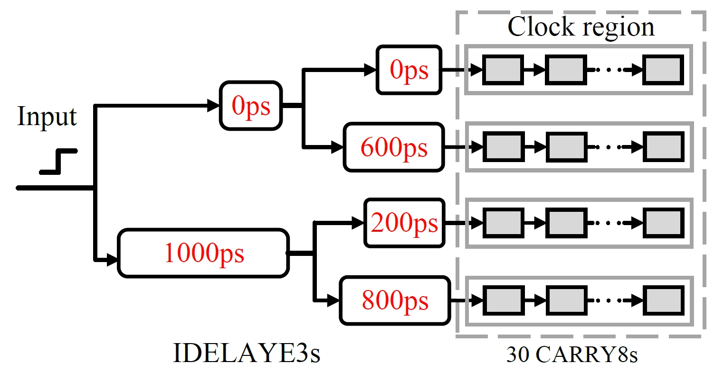
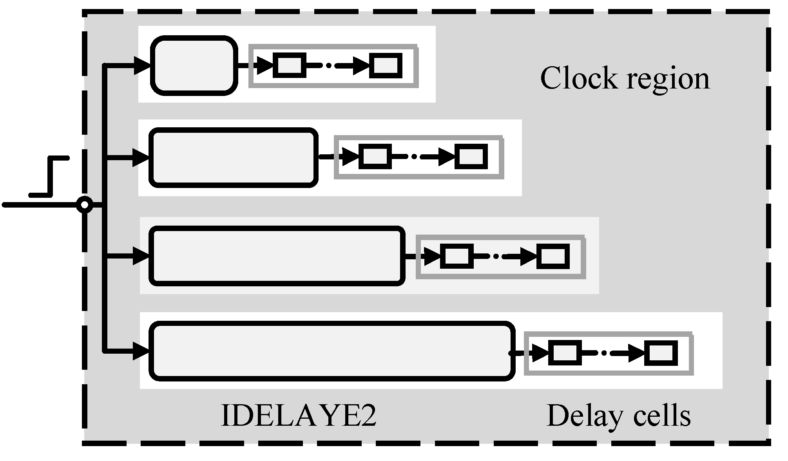
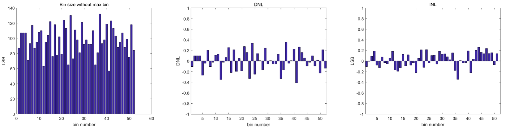
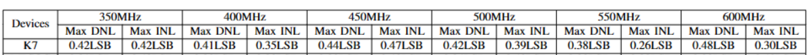
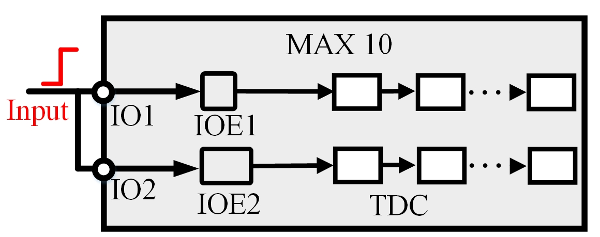
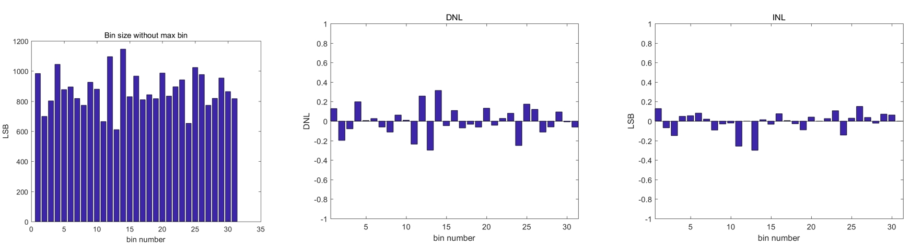

# parcha
A resource-efficient and calibration-efforts free TDC using parallel short chains

The basic structure of ParCha is shown in the following figure:
 

The key insights of our proposal is to architect a TDC using Parallel short Chains. We reallocate the measurement range of each short chains by introducing appropriate fix delay, so that they can equivalently formulate a long chain. This can effectively minimize delay cell heterogeneity, thereby eliminating the reliance on tedious calibration efforts or redundant resources. 

We have specially test our architecture on three different platforms, including AMD 16nm Ultrascale+ MPSoc XCZU7EV-2FFVC1156, AMD 28nm Kintex-7  XC7K325T, and Intel 55nm MAX10 FPGA. 

(1) On 16nm Ultrascale+ FPGA, we leverage IDELAY3 to introduce appropriate delay, which has a time resolution of 1ps in the timing mode (2.1ps in counter mode). We use CARRY8 as chain resources. The specific architecture on this FPGA is shown in the following figure:

 

The code density test results under 400MHz clock is shown in the following figure (without any calibration efforts).

 

We have tested respective results under different clock frequencies.  Results are displayed under the following table:
 

(2) On 28nm Kintex-7 FPGA, the chain resource becomes CARRY4 and IDELAY2. The specific structure implemented in this FPGA is shown in the following figure:
 

The code density test results are:
 

results under different clock frequencies:
 

(3) On 55nm MAX10 10M50DAF484C6GES, we use Programmable IOE delay to introduce appropriate delay for each short chain. And we use LUT as delay cells in each short chain. 

The structure of TDC on this platform is:
 

It should be noted that the IOE unit on Intel FPGA is locked to GPIOs. Therefore, they are less flexible than IODELAY on AMD FPGA. If you need to chain multiple IOEs in order to achieve desired propagation delay, you would have to make outside connections. 

The code density results under 350MHz clock frequency are:
 

 

