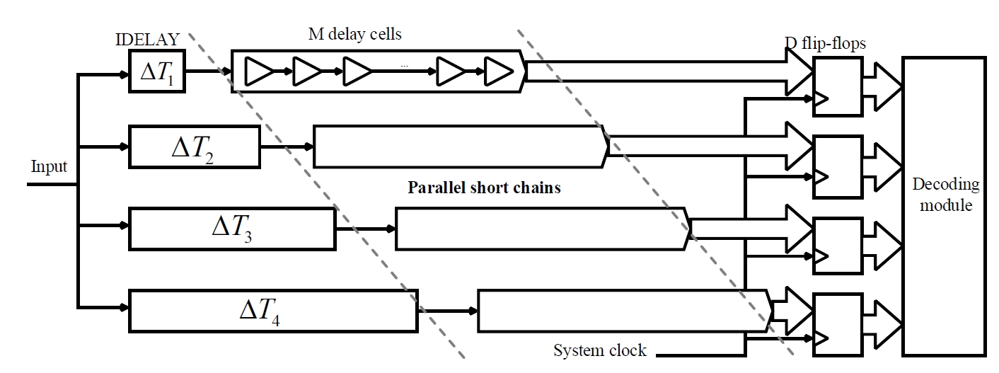
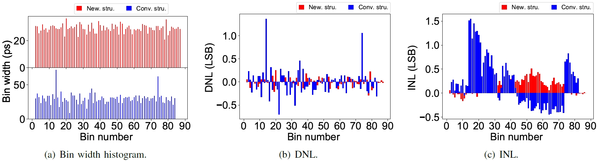
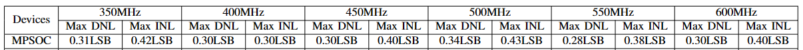

# parcha
A resource-efficient and calibration-efforts free TDC using parallel short chains

The basic structure of ParCha is shown in the following figure:
 

The key insights of our proposal is to architect a TDC using Parallel short Chains. We reallocate the measurement range of each short chains by introducing appropriate fix delay, so that they can equivalently formulate a long chain. This can effectively minimize delay cell heterogeneity, thereby eliminating the reliance on tedious calibration efforts or redundant resources. 

We have specially test our architecture on three different platforms, including AMD Ultrascale+ MPSoc XCZU7EV-2FFVC1156, AMD Kintex-7  XC7K325T, and Intel MAX10 FPGA. 

On Ultrascale+ FPGA, we leverage IDELAY3 to introduce appropriate delay, which has a time resolution of 1ps in the timing mode (2.1ps in counter mode). We use CARRY8 as chain resources. The code density test results under 400MHz clock is shown in the following figure (without any calibration efforts).

 

We have tested respective results under different clock frequencies.  Results are displayed under the following table:
 

 

